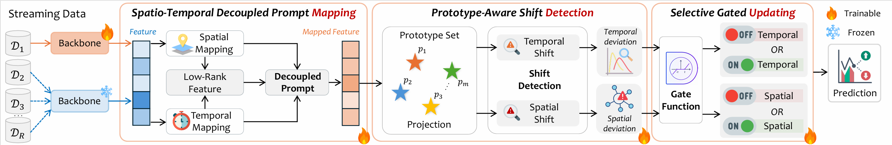

<div align="center">
  <h2><b><big>🔌 DeSCA</big>

 <u>De</u>viation-aware <u>S</u>patio-temporal <u>C</u>ontinual <u>A</u>daptation: A Plug-and-Play Framework for Streaming Spatio-Temporal Prediction</b></h2>
  <p><em>Paper under review</em></p>
</div>
<div align="center">

</div>
<div align="center">
> ⭐ DeSCA is a plug-and-play framework for streaming spatio-temporal prediction, enabling continual adaptation to evolving graph structures and distribution shifts.
</div>

## Updates/News:
🚩 **News** (Jun. 2026): DeSCA framework is now fully open source with support for streaming spatio-temporal prediction!

## 📖 Introduction
DeSCA is a plug-and-play continual adaptation framework for streaming spatio-temporal prediction.

Unlike conventional forecasting models, DeSCA is designed as an external adaptation module that can be seamlessly integrated into diverse forecasting backbones. It enables existing models to continuously adapt to evolving graph structures and distribution shifts while alleviating catastrophic forgetting.

The framework consists of two key components:

- Spatio-temporal Decoupling Module (SDM)
- Deviation-aware Adaptive Update Module (DAUM)

Together, these components identify representation deviations, selectively update model parameters, and maintain long-term forecasting performance in dynamic streaming environments.
<p align="center">
    
</p>

## 📊 Datasets
The framework supports the following datasets:

| Dataset | Description | Scenarios |
|---|---|---|
| **PEMS-Stream** | Traffic flow data from California highways | Traffic forecasting |
| **AIR-Stream** | Air quality monitoring data | Air quality forecasting |
| **PEMS04** | Traditional PEMS dataset for baseline comparison | Traffic forecasting |

### Dataset Download
- **PEMS-Stream** and **AIR-Stream**: Available from the [EAC repository](https://github.com/Onedean/EAC)
- **PEMS04**: Available from the [TEAM repository](https://github.com/kvmduc/TEAM-topo-evo-traffic-forecasting)

Please download the datasets and place them in the `data/` directory.

## 🚀 Getting Started

### Installation

Create and activate the environment:

```bash
conda env create -f environment.yaml
conda activate stg
```

### Quick Start

DeSCA is a plug-and-play continual adaptation framework that can be integrated into different streaming spatio-temporal forecasting backbones.

#### Example 1: DeSCA + EAC

```bash
python main_pre.py \
    --conf conf/PEMS/eac.json \
    --gpuid 0 \
    --seed 43
```

#### Example 2: DeSCA + STBP

```bash
python mainSTBP.py \
    --conf conf/PEMS/STBP_PEMS.json \
    --gpuid 0 \
    --seed 43
```

#### Example 3: DeSCA + DCRNN

```bash
python main_pre.py \
    --conf conf/PEMS/DCRNNplus.json \
    --gpuid 0 \
    --seed 43
```

#### Example 4: DeSCA + PDFormer

```bash
python main_pre.py \
    --conf conf/PEMS/PDFormerplus.json \
    --gpuid 0 \
    --seed 43
```

#### Run All Experiments

To reproduce all experiments reported in the paper:

```bash
bash scripts/run_all.sh
```

| Backbone / Method | Category |
|-------------------|----------|
| EAC | Continual forecasting |
| STBP | Continual forecasting |
| DCRNN | Spatio-temporal forecasting |
| PDFormer | Spatio-temporal forecasting |

DeSCA is not a standalone forecasting model.
Instead, it serves as a plug-and-play continual adaptation module that can be integrated into different streaming spatio-temporal forecasting backbones.

## 🎯 Experimental Results

后补


## 🔗 Acknowledgement

We gratefully acknowledge the following open-source projects, whose codebases, datasets, and research insights have supported the development of this work:

- [EAC](https://github.com/Onedean/EAC)
- [STBP](https://github.com/Aoyu-Liu/STBP)
- [DCRNN](https://github.com/liyaguang/DCRNN)
- [PDFormer](https://github.com/BUAABIGSCity/PDFormer)
- [TrafficStream](https://github.com/AprLie/TrafficStream)
- [STKEC](https://github.com/wangbinwu13116175205/STKEC)

We thank the authors for their valuable contributions to the spatio-temporal forecasting and continual learning communities.